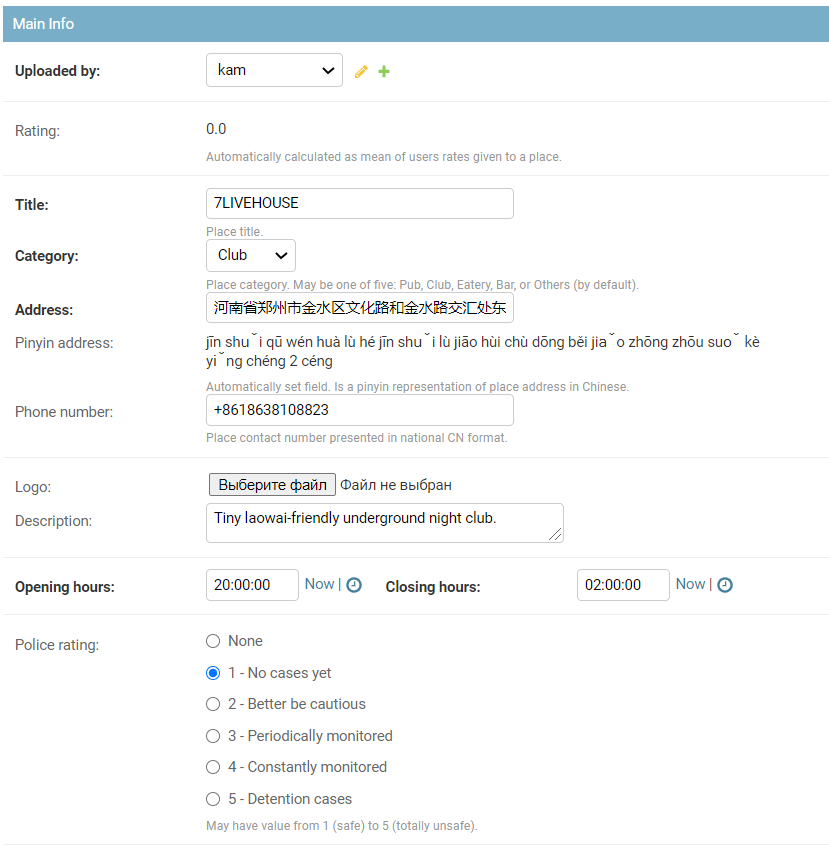
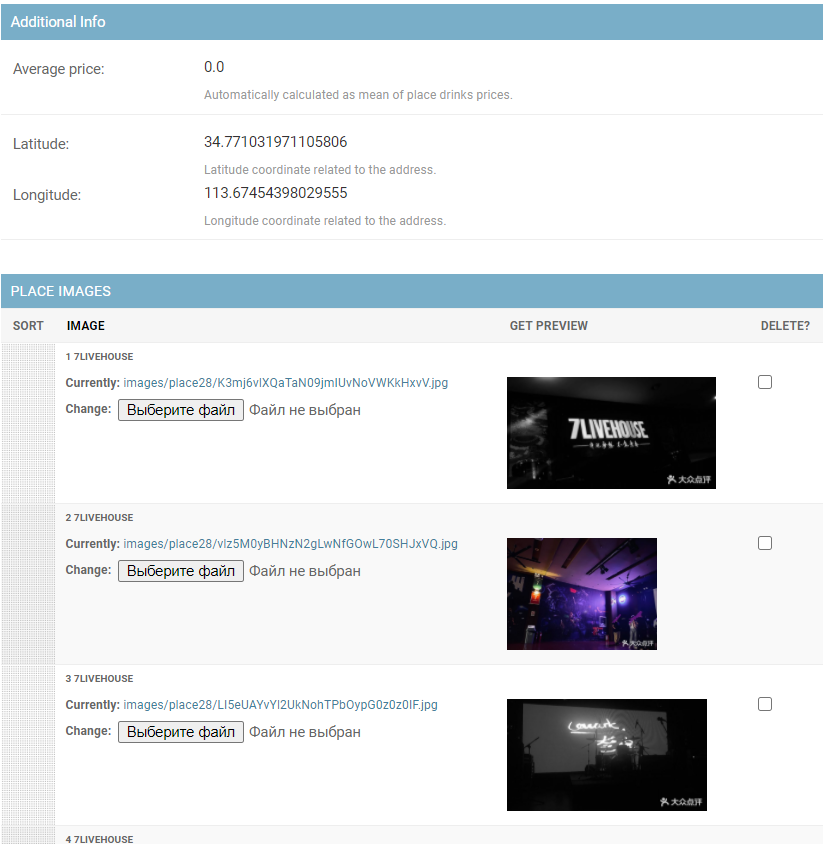
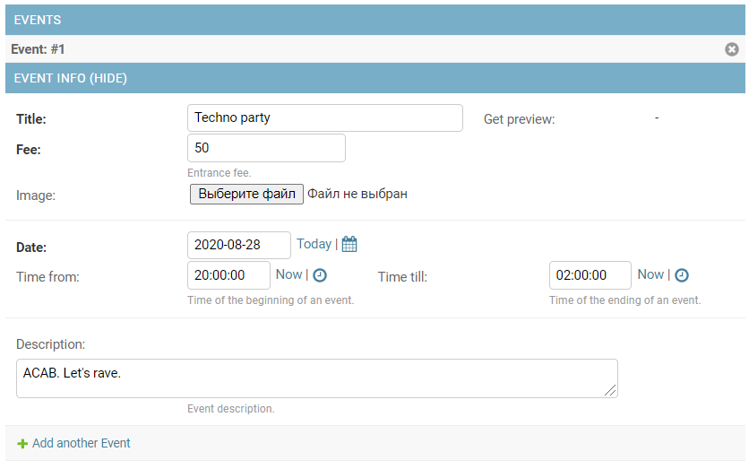

# picom летняя кухня 2020-7

Веб-приложение с заведениями китайского города.

[Here we go!](https://kmnrm2.pythonanywhere.com)

### Backend

[Swagger specifications](https://kmnrm2.pythonanywhere.com/api/swagger/)

*Заведения имеют следующие атрибуты:*
- название (обязательное поле)
- владелец
- категория (бар, клуб, кафе, паб) (обязательное поле)
- рейтинг безопасности от 1 до 5 (police rating)
- описание
- адрес на китайском (обязательное поле)
- адрес на пиньине (рассчитывается автоматически)
- логотип заведения (изображение размером 100х100)
- номер телефона (с валидацией; формат - CN national)
- режим работы
- средняя стоимость напитков/блюд (рассчитывается автоматически как mean)
- кординаты - широта и долгота (рассчитываются автоматически через геокодер)
- фотографии (представлены отдельной моделью)
- отзывы
- рейтинг (рассчитывается как среднее арифметическое имеющихся оценок отзывов)
- события (events, Events model related name)
- напитки (drinks, Drink model related name)

*Атрибуты события:*
- название
- заведение, в котором оно проводится (foreign key Place)
- описание
- стоимость на входе
- фото афиши
- дата события
- время начала события
- время окончания события

*Атрибуты напитка:*
- название
- цена
- место, в котором его наливают 

*Атрибуты отзыва:*
- автор отзыва
- место, на которое оставлен отзыв
- текст отзыва
- оценка (необязательное поле, в таком случае оценка 0)
- дата публикации отзыва

##### Права доступа
При регистрации пользователь автоматически попадает в группу "Users". Чтобы создать заведение пользователь должен находиться в группе "Owners"(владелец). Заведения может создавать и редактировать только владелец, напитки и события добавлять и редактировать может только создатель заведения.

##### Фильтрация
Реализована фильтрация `places-list` по названию заведения (`title__contains`).
```shell script
http://hostname/api/places?title=space
```


#### Модели:
- Place
- Place Image
- Event
- Place Review
- Drink


#### Пример админки

#### Place Admin

Структура:
- Main info
- Additional info
- Images
- Events

 **Main info**




**Additional info and images**



**Events**



Данные из базы данных передаются на фронтенд [в формате `geoJSON`](place.json).


#### Запуск сервера
```bash
picom$ pip3 install -r requirements.txt
picom$ python3 manage.py migrate
picom$ python3 manage.py runserver
```
