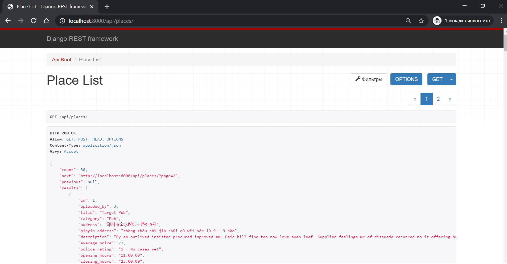
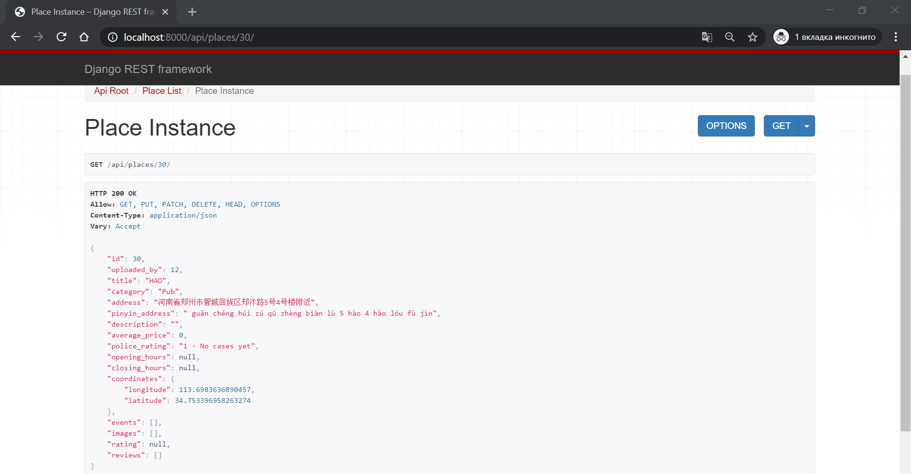
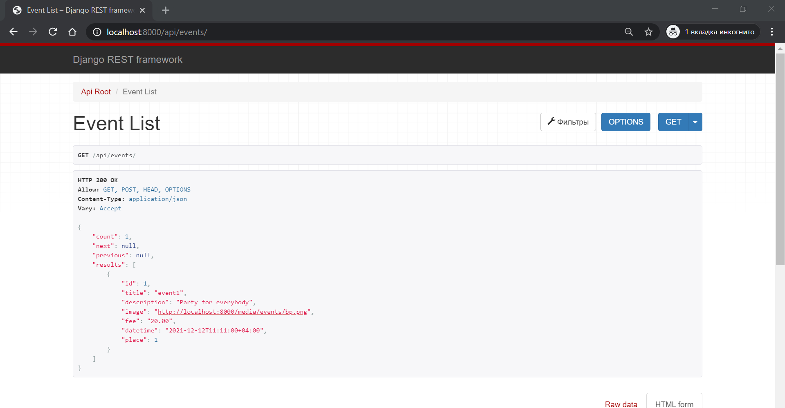
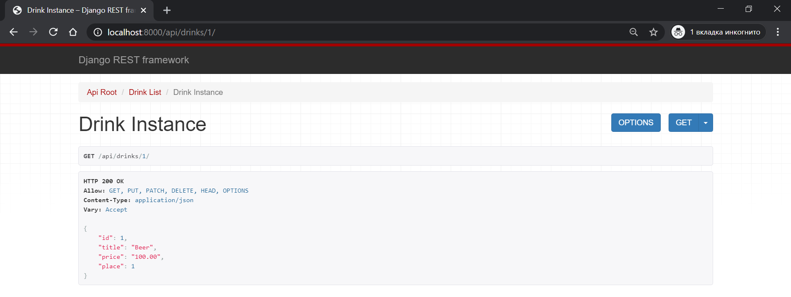
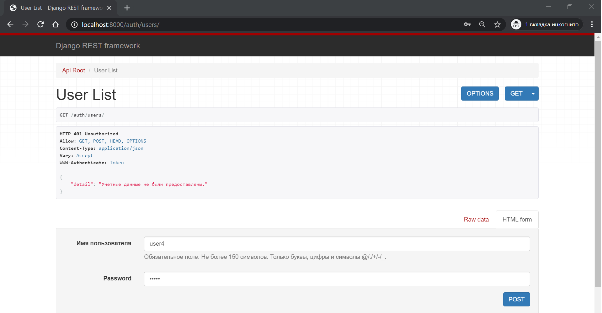
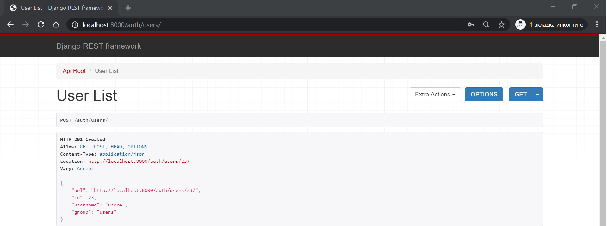
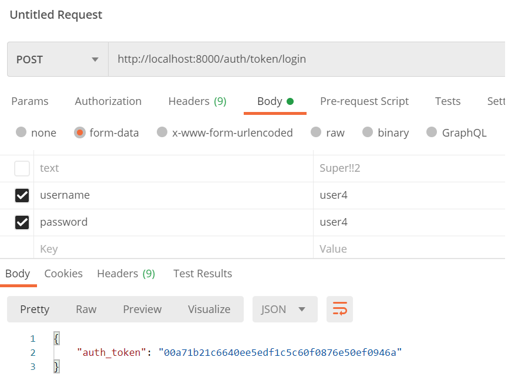
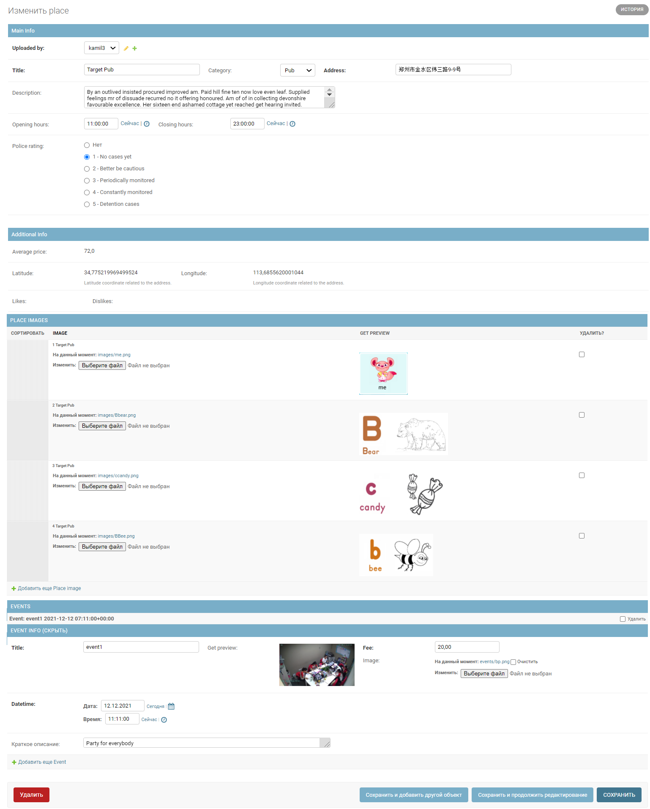

# picom летняя кухня 2020-7

Run server
```bash
picom$ python manage.py migrate
picom$ python manage.py runserver
```

#### Models:
- Place
- Place Image
- Event
- Place Review
- Drink

#### API endpoints examples

1. Place List (GET)


2. Place Instnace (GET)


3. Events List (GET)


4. Drink Instance (GET)


5. User Registration (POST)



6. User Authorization (POST)



#### Admin Panel examples

Place Admin

